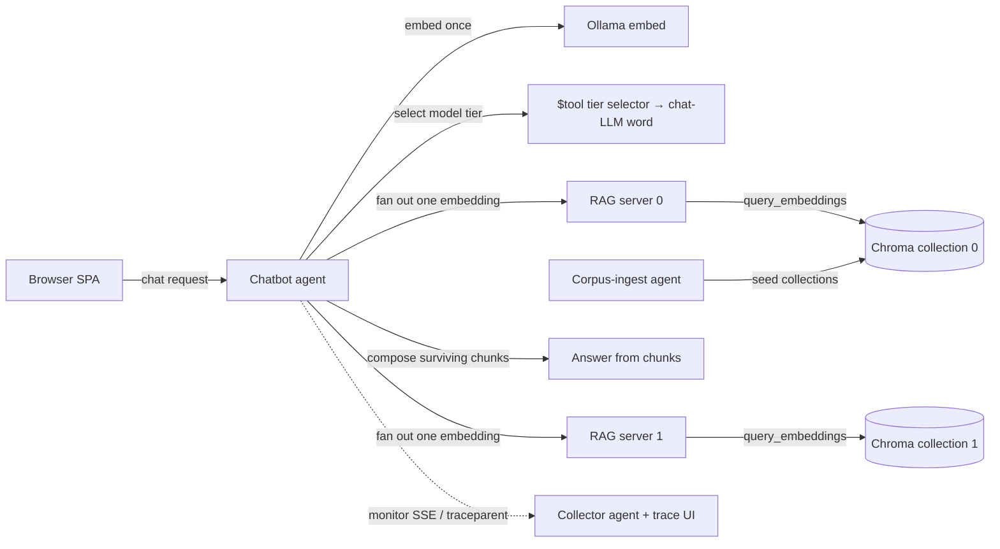

<!-- Copyright (c) 2026 Nokia -->
<!-- SPDX-License-Identifier: BSD-3-Clause -->

# chatbot-mesh

A routed, multi-RAG, observable, deployable chatbot built entirely from declarative agents on the agent-core runtime.

## Purpose

The chatbot mesh is a copyable example program. A browser-facing chatbot agent runs a request-scoped turn: it embeds the message once, routes the question to a chat model, fans the embedding out to one or more retrieval-augmented generation (RAG) servers, composes an answer from the surviving sources' chunks, and streams observability for the turn. One Helm chart deploys the whole mesh, including an in-cluster model tier.

Every agent is a YAML profile the agent-core runtime loads. There is no bespoke orchestration code: the topology, the routing, the fan-out, and the deployment are configuration. The example demonstrates that a multi-agent system is a program you write in profiles and run on a shared runtime.

The example is a copyable *application*, not a standalone runtime or profile
library. It runs on the published agent-core image and keeps reusable corpus
ingest behavior canonically owned by `applications/catalog`. A copied directory
needs that catalog checkout only while packaging or running local ingest
integrations; set `catalog_root` in `demo.yaml` to it. The resulting Helm archive contains the
canonical closure and has no runtime dependency on the profile checkout.

For a reader's walkthrough of how the parts fit together — a single chat turn, live reconfiguration, and deployment, with diagrams — see [docs/guides/how-it-works.md](docs/guides/how-it-works.md).

## Composition



## Status

The module status is `implemented`. The example spans both planes. The data
plane is the chatbot, the RAG servers, a corpus-ingest agent that seeds the
vector store, observability, and Helm deployment. The control plane is a
provisioning-workflow-orchestrator agent, a creator agent, and an applier that
applies rollout changes to the running mesh. The canonical catalog collector
agent owns both signals — spool evidence and a bounded query surface for traces
and metrics, plus the trace UI — so no separate metric backend is needed. An
observer agent discovers mesh pods via the Kubernetes API and polls each
agent's monitor surface to serve a fleet-level view at observer.localhost. The
profiles run on agent-core. Release 05 remains partial pending one live
ingest-to-grounded-turn proof.

## Capabilities

`agents/application.yaml` records `runnable_module`, `managed_service`,
`packaged`, `helm_managed`, `kind_demo`, and `ui` as `implemented`, with
application-owned commands and tests for each capability.

## Decisions

Four decisions frame the extraction. They are recorded here so a reader understands the shape of the example.

1. Copyable composition on shared platform assets. The example runs on the
   agent-core image. Its corpus-ingest wrapper references the canonical
   applications/catalog knowledge-manager program through the documented
   demo.yaml `catalog_root` build dependency; all other application agents remain
   local. Packaging embeds that canonical closure into the chart.

2. The mesh owns Chroma retrieval configuration, not reusable ingest behavior.
   The RAG server keeps its Chroma REST config inline, and
   `agents/corpus-ingest/` keeps the wrapper plus `corpus-rest.yaml`. Trusted
   discovery, machine, declarations, and tools come from the canonical library.

3. A served UI lives under its serving agent. The single-page application sits at `agents/chatbot/ui/` and the observer's fleet view at `agents/observer/ui/`, each beneath the agent whose `static_assets` binding serves it, per the `eng02-agent-ui-placement` guideline (GH-1316). The deployment chart stays top-level under `helm/`, distinct from the profiles it deploys.

4. Co-generation stays, for now. The Helm chart renders the chatbot client config, the user interface, and the N-RAG fan-out from the chart values; the packaged profile copies are the local integration source and the render overrides them in the cluster. Inverting this so the profile is the source is a separate follow-up.

## Ownership Boundaries

Chatbot Mesh is `agent-owning`: five local role realizations contribute to
repository agent totals. The local corpus-ingest and applier profiles are
composition wrappers over catalog-owned implementations and are reported
separately. The catalog also owns collector; agent-core owns runtime semantics.
The application owns composition, topology, deployment, UI, credentials,
operator workflow, and end-to-end evidence.

## Layout

```
applications/chatbot-mesh/
  docs/           VISION, ARCHITECTURE, road-map, and the example's own specs
  agents/         chatbot, rag-server, corpus-ingest, provisioning-workflow-orchestrator, creator, applier, collector, observer
                  (chatbot/ui/ holds the SPA; observer/ui/ the fleet view)
  helm/           the deployment chart
  observability/  the persistent telemetry ingress state (.run/, gitignored)
  README.md       this file
  magefile.go     the example's own audit and integration entry
```

## Run or Planned Entry Points

The example carries its own magefile. From this directory:

```bash
mage audit                     # validate the example's specification corpus
mage helm:package              # stage profiles and build the installable chart
mage presentation              # serve the "One question through the mesh" slide deck
mage integration:chatbot       # run a routed fan-out chatbot turn
mage integration:controlPlane  # exercise the provisioning-workflow-orchestrator and creator control plane
mage integration:rig           # run hermetic agent scenarios, including collector intake
```

The telemetry-required gates (`integration:rig`, the helm telemetry checks)
need the persistent OTLP ingress: the canonical collector agent run as a
background host process, accepting both trace and metric exports on one gRPC
listener and retaining them in its spool (srd008-telemetry R9, srd042 R8/R9).
There is no docker-compose stack and no Prometheus backend; kind remains the
only Docker consumer. Standalone targets leave the host collector running for
reuse. The aggregate stops its collector after every concurrent lane finishes,
so removing its source worktree cannot orphan a process; the spool still
outlives the run. `up`, `down`, and `reset` serialize their complete collector
reconciliation through a bounded advisory lock in the repository's Git common
directory, so linked worktrees cannot race the inspect/stop/start transaction
and a crashed holder releases the lock automatically. `down` also keeps that
evidence, and only `reset` deletes it.

```bash
mage observability:up      # build the agent and start the ingress, or reuse a healthy one
mage observability:status  # report whether the ingress is running and healthy
mage observability:down    # stop the ingress, keep the trace and metric spool
mage observability:reset   # stop the ingress and delete the spool
```

Defaults expose OTLP gRPC on `4317`, collector control on `18191`, collector
monitor on `18192`, and the collector query surface on `18193`
(`/query/traces` and `/query/metrics`);
override with `otel_grpc_port`, `collector_control_port`,
`collector_monitor_port`, `collector_query_port`, and `collector_bind_host`
in `demo.yaml`. The ingress shares ports 4317 and 18193 with the
agent-architecture demo's local collector, so stop it before running that
demo. It runs the canonical collector profile from the sibling
`applications/catalog` checkout, built from the `agent-core` checkout (set
`core_root` in `demo.yaml` when it is not a sibling); its state lives under
`observability/.run/` (gitignored).

The magefile hands the collector child process its `COLLECTOR_*` environment.
Those variables are the collector profile's declared parameterization
contract — agent-core expands `${VAR:-default}` references in mounted
declarations (srd013 R5.6/R5.7) — so the magefile sets them the same way a
Helm chart sets pod env. The magefile's own configuration comes from
`demo.yaml`, never from the environment: `inference_timeout` bounds one model
call made directly by an integration tracer. It does not bound the canonical
Chroma corpus-ingest agent, whose profile-owned calls may each take 300 seconds.
`chroma_ingest_timeout` instead bounds that complete multi-call ingest run
(default `20m`), including startup, embedding, Chroma writes, and terminal
verification. `chroma_integration_chat_model` selects the bounded evidence
model for `integration:chroma` (default `qwen2.5:3b`) through the canonical
profile's declared `CORPUS_CHAT_MODEL` child contract; it does not change that
profile's `ornith:9b` operator default. `integration_otlp_endpoint` points
integration launches at a live OTLP ingress (empty keeps them file-only).

The shared ENG01 operator verbs are:

```bash
mage doctor      # read-only tool/version and Docker Desktop resource checks
mage demo:up     # create/reuse da-chatbot-mesh-demo and print .localhost URLs
mage demo:down   # delete only da-chatbot-mesh-demo
```

`demo:up` is an explicit request, so missing or outdated tools and insufficient
Docker Desktop resources fail with remediation instead of producing an
integration-style skip. A cluster created by a failed demo deployment is
removed; a pre-existing demo cluster is reused and never removed implicitly.
The browser demo reuses Ollama on the host through `host.docker.internal` and
the models named by the chart values; `helm/ci/kind-values.yaml` selects that
external endpoint. This keeps one model store and runtime on a laptop.
`mage integration:helmLLMTier` separately proves the
optional self-contained in-cluster Ollama tier and its preload gate.

`mage helm:package` and local integrations that exercise catalog programs
resolve the demo.yaml `catalog_root` once from this application root, defaulting through
repository discovery to `applications/catalog`. Copying this application
therefore requires an explicit catalog checkout for build/test, but the packaged
chart is self-contained at runtime and does not silently fork canonical programs.

Run `mage -l` to list the named `integration:*` targets; each skips cleanly when its toolchain is absent. There is no `integration:collector` lifecycle target yet.

## Verification

From `applications/chatbot-mesh`, run `go test ./...`, `mage audit`, and
`mage helm:package`. The root `mage test`, `mage audit`, and `mage stats` gates
also include this application.

`mage audit` is the self-governance gate. It runs the catalog specification-critic validator
over the application's own corpus, so it needs the agent-core runtime
(`core_root` in `demo.yaml`, default repository `agent-core`) and the catalog root
(`catalog_root` in `demo.yaml`, default repository `applications/catalog`).
`spec_critic_profile` in `demo.yaml` may override the profile within that
catalog. Unlike optional `integration:*` targets, audit fails clearly when a
required platform tool is missing.

The agents run on the agent-core image with a mounted profile, for example `agent --profile agents/chatbot/profile.yaml`. The Helm chart deploys the mesh on a kind cluster; see `helm/` for values and CI configuration.

Driving the SPA in a browser uses the canonical documentation-curator
[`ui/docs` package](../catalog/agents/knowledge-manager/documentation-curator/ui/docs/):
run `npm ci` there and invoke
`npm run test:e2e:machine-request -- --executable-path=/path/to/browser` with a
system Chrome or Chromium executable.
The [browser E2E runbook](../../agent-core/README.md#browser-end-to-end-tests)
explains why the shared package owns `puppeteer-core` and downloads no browser.

## Documentation

Start with `docs/VISION.yaml`, `docs/ARCHITECTURE.yaml`, `docs/road-map.yaml`,
and `docs/SPECIFICATIONS.yaml`. Deployment package details are in
`helm/PACKAGING.md`; the operator walkthrough is in `docs/guides/how-it-works.md`.
