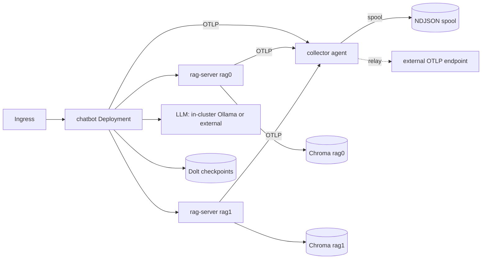

<!-- Copyright (c) 2026 Nokia -->
<!-- SPDX-License-Identifier: BSD-3-Clause -->

# chatbot-mesh

A Helm chart that deploys the chatbot mesh on Kubernetes: the browser-facing chatbot agent, a values-driven list of RAG units (each a rag-server agent paired with its own Chroma database), a chat/embedding LLM, a Dolt checkpoint backend, and the canonical catalog collector with a spool query surface.

## Architectural thesis

One runtime image serves every agent role. Each agent's program is a profile supplied from a ConfigMap and mounted at `/profiles`, not baked into the image, so the same image runs the chatbot and every rag-server and a values change re-renders the topology without rebuilding images (the agent-core mounted-profile contract; see `docs/SPECIFICATIONS.yaml` platform references). The RAG topology is one values list: each entry renders a rag-server Deployment/Service and a Chroma StatefulSet/Service plus the chatbot's ordered topology data, network allowlist, and monitor upstream. The chatbot retains one selected-target REST operation and one sequential `for_each` regardless of source count.

## Topology



## Scope and status

This chart is the deployment topology: chatbot, N RAG units from `ragUnits`, LLM, Dolt, and collector, with ingress and internal Services, over the runtime image with ConfigMap-mounted profiles (srd003 R1, R5). The `helm template`/`helm lint` render is verified. The chart co-generates the chatbot `rest.yaml` and ux from `ragUnits`; add/remove rollouts ask the old chatbot to drain active HTTP turns before it exits, then route subsequent turns to the replacement pod (srd003 R2, R3). Dolt persists checkpoints but cannot preserve an existing client socket. The kind smoke test values live under `ci/`. Control-plane provisioning is out of scope for this data-plane example.

## Repository structure

```
helm/
  Chart.yaml            chart metadata
  values.yaml           default values (ragUnits is the topology source of truth)
  values.schema.json    values validation
  templates/            chatbot, rag-units (ranged), dolt, collector, ollama, profiles ConfigMap
  profiles/             agent programs packaged into the profiles ConfigMap (see PACKAGING.md)
  ci/kind-values.yaml   small-footprint values for the smoke test
```

## LLM tier

The chart ships an in-cluster LLM tier (srd003 R6): an Ollama StatefulSet with a PVC for model storage, a model-preload `Job` that pulls the declared models, and a readiness gate so the chatbot waits (in an init container) until every model is present in Ollama `/api/tags` before it serves. It is enabled by default, so a fresh-cluster `helm install` is self-contained.

The models are named once in `ollama.models` (the embedding model, the chat models, and the tier-selector model) and feed both the preload Job and the co-generated agent config, so a model cannot be preloaded but unrendered or gated-on but unpulled.

To point at an operator-supplied Ollama instead, disable the tier and override the endpoint — the render is identical to the pre-tier external behavior and the co-generated client entries are unchanged (R2):

```bash
cd applications/chatbot-mesh
mage helm:package
helm install mesh helm/dist/chatbot-mesh-*.tgz \
  --set ollama.enabled=false \
  --set llm.externalURL=http://my-ollama:11434
```

GPU scheduling is values-driven: set `ollama.gpu.count` and provide `ollama.nodeSelector`/`ollama.tolerations` for a GPU node pool. The `ci/kind-llm-values.yaml` smoke path runs CPU-only small models; this diverges from GPU production sizing by design (R6.4, recorded limitation). Topology defaults to a single Ollama instance serving all models (`ollama.topology: single`); `per-model` maps to the embedding-vs-chat two-service split (R6.5).

Realized as chart-owned templates rather than a nested Helm subchart so the Ollama Service keeps the `<release>-chatbot-mesh-ollama` name the co-generated LLM URL depends on.

## Package and install from a checkout

The canonical agent programs live beside the chart under `agents/`;
the source `helm/` directory is not an install artifact by itself. Package it
first so every required profile and SPA asset is staged into the chart:

```bash
cd applications/chatbot-mesh
mage helm:package
helm install chatbot-mesh helm/dist/chatbot-mesh-*.tgz \
  -f helm/ci/kind-llm-values.yaml
```

Setting `helm_dist` in `demo.yaml` overrides the output directory `mage helm:package` writes to. The
package target prunes profile test fixtures and stages only the UX descriptor
and built SPA, keeping the profiles ConfigMap below Kubernetes' size limit. It
also rejects unclassified source files, validates the supported values matrix,
checks the archive's exact inventory, and lints and renders the archive
independently. Existing `helm/dist` and `helm/profiles` content is never staged.

## Upgrading the deployment agent

The rollout agent was renamed from executor to applier. This is a breaking
values-key change: operator values files must rename the top-level `executor:`
mapping to `applier:`. Image overrides must likewise move from
`executor.image.*` to `applier.image.*`; the rendered workload and service are
now named `<release>-chatbot-mesh-applier`.

The control-plane actor formerly named `coordinator` is now
`provisioning-workflow-orchestrator`. This coordinated breaking migration moves
the profile path, ConfigMap keys, workload, Service, NetworkPolicy, component,
container, and OTel identities. Operator values must rename
`controlPlane.coordinator` to
`controlPlane.provisioningWorkflowOrchestrator`. No runtime compatibility alias
is shipped because the old identity collided with canonical Coordinator while
realizing Executor / Workflow Orchestrator; all chart consumers move together.

## Technology choices

Profiles ride in a ConfigMap projected to nested paths through `items[].path`, because ConfigMap keys cannot contain `/`; this keeps one image and lets a values edit re-render an agent's program. The collector agent spools traces to NDJSON and serves a query surface for the observability panel's cross-agent waterfall; relay to an external OTLP endpoint is conditional on `collector.externalOTLPEndpoint`.

## Render and lint

```bash
helm lint applications/chatbot-mesh/helm
helm template mesh applications/chatbot-mesh/helm
helm template mesh applications/chatbot-mesh/helm -f applications/chatbot-mesh/helm/ci/kind-values.yaml
```

Agents export traces to the collector through the `--otel-otlp-endpoint` flag wired from the collector Service; set `collector.enabled=false` to disable.
