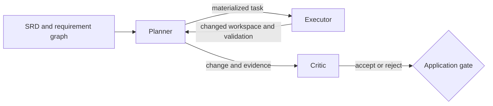

<!-- Copyright (c) 2026 Nokia -->
<!-- SPDX-License-Identifier: BSD-3-Clause -->

# coding-agent

A deployable planner, executor, and critic coding loop built from canonical
`applications/catalog` agents.

## Purpose

The coding agent is an application composition. A planner turns SRD context into
a task and delegates it to an executor. The executor changes an isolated
workspace and runs declared validation. A critic evaluates the produced change
and gates the final outcome.

Composition, integration fixtures, packaging, and deployment belong to this
application. The three agent families keep their canonical profiles and
requirements in `applications/catalog`:

- `srd002-executor`
- `srd003-critic`
- `srd004-planner`

This directory owns the application reference manifest, profile-closure
packaging, persistent serving composition, live integration targets, and
portable fixture in addition to the application specification. Helm assets
consume the role-sharded package without redefining profile membership.

## Composition



The integration contract has three ordered stages:

1. A live executor completes the greet task and leaves `go test ./...` green.
2. The real planner materializes that task and delegates through the real built
   agent binary to the real executor.
3. The critic evaluates the produced change and its report gates the terminal
   application state.

No stage may replace an agent boundary with `writeGeneratorChildAgent`, a shell
script, or another fake agent binary.

## Packaging and runtime boundary

`agents/application.yaml` is the Release 14 composition authority. It names the
canonical planner, executor, critic session, and critic changed-workspace roots,
plus the canonical collector and local planner, executor, critic, and applier
deployment roots. Its UI section also declares the collector's served `ui/dist`
asset and package destination. The three
serving wrappers live directly under `agents/<actor>/`; their shared lifecycle
wrapper lives at `agents/role-server/`. This name records its explicit
application ownership and purpose without inventing a `common` actor. The
wrappers reference canonical library assets and do not copy their machines,
declarations, or reusable role behavior.

From this directory, assemble the deployable role closures:

```bash
mage package
mage packageValidate
```

The default output is `build/profiles`; set `profiles_output` in
`demo.yaml` to select another output directory and
`catalog_root` to package a different checkout. The resolver follows
profile-local `machine`, tool-selection, declaration, config-directory, REST,
child-profile, and nested critic references. Relative references resolve from
the YAML file that declares them; `agents/...` references resolve from the
catalog root. The copied destination preserves those runtime paths.
Only `/opt/agent-core/...` absolute references are external. Traversal, other
absolute paths, globs in runtime references, symlinks, dangling references, and
two sources targeting one destination fail packaging.

`build/profiles/deployment-manifest.yaml` records the profile-free runtime
contract and every sorted manifest deployment shard, including `collector`.
Each role
directory is an independent root mounted at `/profiles` and contains only its
resolved closure. `build/profiles/manifests/<role>.yaml` lists the serving entry
profile, exact reachable files, provenance, and deterministic ConfigMap
partitions. Partitions are capped at 900 KiB of encoded key/value payload to
leave Kubernetes object metadata headroom. A single entry above that bound
fails as unshardable.

`mage packageValidate` builds the production agent binary, packages into a
temporary output, and runs `--validate-config` against each role entry profile
from its own shard root.

When the source checkout is exactly the compatible clean release, provenance
records that release. Otherwise it records `kind: checkout`, the checkout
revision (or `unversioned-checkout` for a fixture), and the compatible release
separately; a checkout is never mislabeled as released. Deployment and role
manifests also record the application checkout revision and dirty state because
the serving composition is application-owned.

The application-owned coding runtime image stays profile-free. It uses the
agent-core runtime plus Go 1.26 and golangci-lint v2.12.2, because the canonical
executor always runs build, lint, and test. Kubernetes runs planner, executor,
and critic as separate containers using that same image. Each container mounts
its role directory under `/profiles` and selects the serving profile named by
that role's manifest. Profiles are application package content, not image
content.

### Parameter inventory

The coding application currently requires no generated override. The serving
planner reuses the canonical planner `llm/default.yaml`; the executor shard
reuses the canonical executor profile, model declaration, machine, and tools;
the critic shard reuses the deterministic changed-workspace profile. The local
batch planner still uses its existing child-agent execution contract.

These are existing profile surfaces, not a new substitution language. A later
deployment may co-generate a profile-local declaration or machine variant and
reference it from an application-owned profile, as the chatbot-mesh chart does.
This packager copies references verbatim and does not interpret placeholders.
No coding-application value is added to the library.

## Capabilities

The manifest records implemented runnable-module, managed-service, packaged,
Helm-managed, kind-demo, and UI capabilities with executable evidence. The UI
claim is the catalog collector surface deployed by this application.

## Core Helm topology

Prepare #875 profile artifacts before linting or rendering the source chart:

```bash
mage image:build
mage helmPrepare
helm lint helm
helm template coding-agent helm
helm template coding-agent helm -f helm/ci/small-values.yaml
mage helm:package
```

The chart defaults to the shared
`ghcr.io/nokia-bell-labs/declarative-agents/agent-core-toolchain:0.1.0` (agent-core
layered with the Go toolchain, GH-1368) and
renders one persistent coding-runtime container per role, projected
read-only role ConfigMaps, one shared workspace claim, fixed internal role
Services, lifecycle probes, optional Ollama, and collector agent tracing. `values.schema.json`, semantic template guards, and fixtures under
`helm/schema-fixtures/` validate values. `mage helm:package` regenerates and
checks prepared profiles, renders the supported matrix, writes
`helm/dist/coding-agent-0.1.0.tgz`, verifies its complete inventory, and renders
the archive independently. Setting `image` in `demo.yaml` overrides the tag built by
`mage image:build`; the live smoke invokes that same Dockerfile rather than a
smoke-only recipe. See the [deployment guide](docs/deployment.md), or run the
bounded packaged-chart proof with `mage integration:helmSmoke`.

## Status

The module status is `implemented` and its ownership classification is
`composition-only`: all local actor profiles are serving or applier composition
wrappers and contribute no additional canonical agent implementation.

All three coding-loop stages and compatible-checkout, transitive profile
packaging are implemented with the production agent-core binary and canonical
profiles. The package records the source revision without claiming release
provenance unless the checkout exactly matches the declared clean release. The
critic receives the existing Stage B workspace, writes its own accepted or
rejected verdict, and the application maps that verdict to Succeeded or Failed.
Application-owned serving profiles now keep planner, executor, and critic alive
behind real lifecycle health endpoints. A request to the planner crosses
declared executor and critic REST clients, while all three processes bind the
same trusted workspace directory and agent-core propagates `traceparent` across
the two remote boundaries. The package-driven core Helm topology is implemented;
schema/package validation and bounded kind deployment proof are implemented.

The existing critic benchmark/session profile remains available unchanged; the
changed-workspace mode is a separate canonical profile variant.

## Ownership Boundaries

The catalog owns reusable planner, executor, critic, collector, and applier
behavior. This application owns its manifest, thin serving wrappers, shared
`role-server` lifecycle wrapper, local applier composition wrapper and command
bindings, package derivation, Helm topology, fixtures, and end-to-end evidence.
Agent-core owns runtime profile, machine, tool, REST, lifecycle, and execution
semantics.

## Layout

```text
applications/coding-agent/
  agents/
    application.yaml
    role-server/
    planner/
    executor/
    critic/
    applier/
  docs/
    VISION.yaml
    ARCHITECTURE.yaml
    road-map.yaml
    SPECIFICATIONS.yaml
    specs/
      use-cases/
      test-suites/
  helm/
    ci/
    templates/
  magefiles/
    profiles_closure.go
  testdata/integration/coding-loop/
  go.mod
  README.md
```

There is no local `specs/software-requirements/` content. Application behavior
traces to the library SRDs, so copying them here would create a second canonical
home.

## Run or Planned Entry Points

All declared entry points are implemented. Use `mage package`,
`mage packageValidate`, `mage helm:package`, and the `mage integration:*`
targets described below.

## Verification

From this directory:

```bash
mage audit
mage stats
```

The shared ENG01 operator verbs are:

```bash
mage doctor      # read-only tool/version and Docker Desktop resource checks
mage demo:up     # create/reuse da-coding-agent-demo and print .localhost URLs
mage demo:down   # delete only da-coding-agent-demo
```

Requested demos fail with actionable guidance when tools, versions, the Docker
daemon, or host resources are unavailable; integrations retain their documented
skip behavior. Failed deployment removes only a cluster created by that
invocation, while a reused demo cluster is always retained.

The audit parses every YAML document, checks required fields and reciprocal
traces, assembles the application closure in a temporary tree, builds the real
agent, boot-validates all four mounted entry profiles (including
`critic/profile-workspace.yaml`), and validates formal test-evidence claims
without turning skipped live runs into passed evidence.

The stats target reports the canonical catalog references and application-owned
serving roles under an `application` key. It deliberately emits no `agents`
section: planner, executor, and critic implementations are counted once under
`applications/catalog`, while `agents_contributed: 0` makes that ownership explicit.

The integration entry points are `mage integration:executorLive`,
`mage integration:plannerDelegation`, `mage integration:criticGate`, and the
aggregate `mage integration:codingLoop`. `mage integration:servingHealth`
always proves all three persistent health endpoints and a deterministic critic
request. `mage integration:servingRemote` proves the real
planner → executor → critic localhost flow with deterministic
Ollama-compatible model responses and production profile, REST, workspace,
critic, lifecycle, and trace behavior.
`mage integration:helmSmoke` installs the packaged chart into kind and proves
the same flow through Kubernetes, including shared workspace mutation and the
connected collector agent trace. It skips only for missing host prerequisites.

## Documentation

- [Vision](docs/VISION.yaml)
- [Architecture](docs/ARCHITECTURE.yaml)
- [Road map](docs/road-map.yaml)
- [Specification index](docs/SPECIFICATIONS.yaml)
- [Deployment and operations](docs/deployment.md)
- [Release 14 actor-directory migration](docs/migrations/rel14.0-actor-directories.yaml)
- [Coding-loop use case](docs/specs/use-cases/rel01.0-uc001-coding-loop.yaml)
- [Coding-loop test suite](docs/specs/test-suites/test-rel01.0-coding-loop.yaml)
