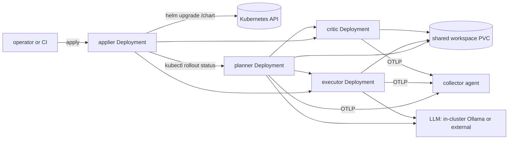

<!-- Copyright (c) 2026 Nokia -->
<!-- SPDX-License-Identifier: BSD-3-Clause -->

# coding-agent

A Helm chart that deploys the coding application on Kubernetes: the planner,
executor, and critic serving roles over a shared workspace, an optional in-cluster
Ollama LLM tier, the canonical catalog collector with a spool query surface, and the
optional deployment-plane applier (srd006).

## Architectural thesis

One profile-free runtime image serves every role: the shared agent-core-toolchain
(agent-core layered with the Go toolchain, GH-1368). Each agent's program is a profile
supplied from a ConfigMap and mounted read-only at `/profiles`, not baked into the
image, so the same image runs the planner, executor, and critic, and a values change
re-renders the topology without rebuilding images (the agent-core mounted-profile
contract; see `docs/SPECIFICATIONS.yaml`). Every manifest deployment entry,
including the catalog collector, is packaged into per-workload ConfigMaps by
`mage helmPrepare`; its declared UI asset is included in the same collector
shard.

## Topology



## Scope and status

This chart is the deployment topology: three serving role Deployments and Services
over the runtime image with ConfigMap-mounted profiles, a shared workspace PVC, an
optional Ollama tier, the collector, and the optional applier (srd003, srd006). The
`helm template`/`helm lint` render is verified, and `mage helm:package` stages the
profiles and validates the archive. Live on-cluster rollout is exercised on the kind
rig (srd005).

## The applier (srd006)

The applier is the deployment-plane actuator: a standalone declarative agent that
realizes a decided values change against this chart. An authorized operator or CI
caller posts a schema-tagged, values-plane patch to the apply endpoint; the applier
validates it against `values.schema.json` with a `helm upgrade --dry-run`, applies it
with `helm upgrade --reuse-values -f overrides.yaml` returning without waiting, verifies
the planner, executor, and critic Deployments with `kubectl rollout status`, rolls the
release back on a verify stall, and reports an apply-command failure as failed.

The applier alone holds helm and kubectl; the serving roles carry no deployment CLI.
It runs the shared applier image, a recorded divergence from the profile-free
runtime image (srd003 R1.2): agent-core plus helm and kubectl, built from
`agent-core/applier.Dockerfile` (GH-1368). The image bakes no chart; the chart it
runs `helm upgrade coding-agent /chart` against is delivered to the pod at `/chart`
as a mounted volume (`applier.chartArchive`, unpacked by an init container), so the
bytes travel with the Helm release. The apply surface carries no inbound
authentication, so a NetworkPolicy gates it off the serving and collector pods; only
an authorized caller reaches it through an explicitly provisioned path.

The applier is disabled by default because its image is not the runtime image the
serving and smoke tests kind-load. Enable it with `ci/kind-applier-values.yaml`.

## Repository structure

```
helm/
  Chart.yaml            chart metadata
  values.yaml           default values
  values.schema.json    values validation
  templates/            agents (ranged roles), applier, collector, ollama, workspace, profiles ConfigMaps
  profiles/             agent programs packaged into ConfigMaps (see PACKAGING.md); gitignored
  ci/                   small-footprint and kind values, including kind-applier-values.yaml
  schema-fixtures/      valid/invalid values fixtures the package target renders
```

## Package and install from a checkout

The agent programs live beside the chart under `agents/`; the source `helm/`
directory is not an install artifact by itself. Package it first so every required
profile is staged into the chart:

```bash
cd applications/coding-agent
mage helm:package
helm install coding-agent helm/dist/coding-agent-*.tgz
```

To install with the applier enabled, build and load its image, then:

```bash
helm install coding-agent helm/dist/coding-agent-*.tgz \
  -f helm/ci/kind-applier-values.yaml
```

## Render and lint

```bash
mage helmPrepare
helm lint applications/coding-agent/helm
helm template test applications/coding-agent/helm
helm template test applications/coding-agent/helm -f applications/coding-agent/helm/ci/kind-applier-values.yaml
```

Agents export traces to the collector through the `--otel-otlp-endpoint` flag wired
from the collector Service; set `collector.enabled=false` to disable.
