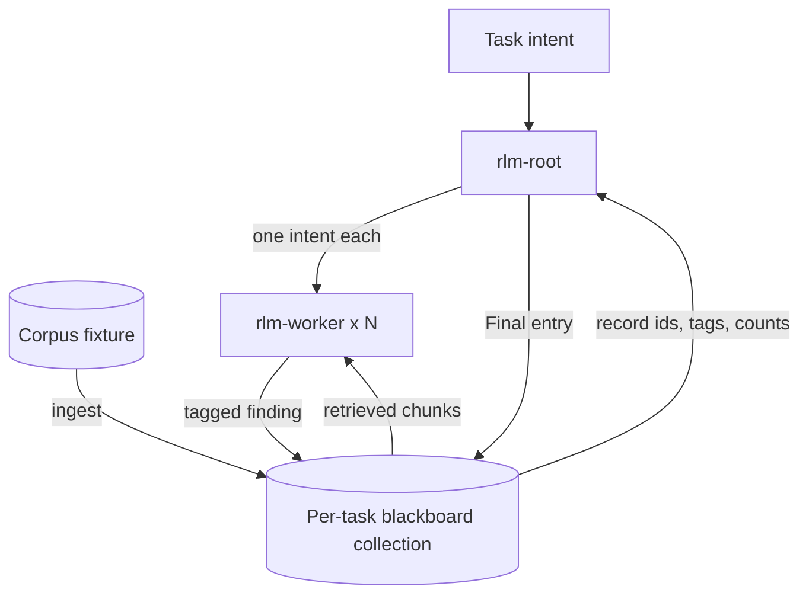

# large-context-swarm

A declarative agent swarm that answers questions about a corpus larger than any
context window, by never putting the corpus in one.

## Purpose

The corpus lives in a per-task Chroma collection. A root agent turns the task
into search intents; ephemeral workers each take one intent, search the
collection, write one provenance-tagged finding back, and terminate; the root
reads those findings by identity and metadata, decides whether to run another
round, and reduces them into a single `Final` entry.

The mechanism comes from Recursive Language Models (arXiv 2512.24601), whose
insight is that a prompt can be an environment a model queries rather than text
it must read. The swarm makes that boundary structural: document text reaches a
worker's context and is discarded when the worker exits, so the root's context
size does not track the corpus size.



## Status

The module status is `audit_only`: the module owns its composition manifest and a
local audit target, and participates in the repository's documentation and stats
gates. It ships no profiles, so it contributes no agents and claims no runnable
capability.

Release 01.0 is specified; the other three are planned:

| Release | Scope | Status |
|---------|-------|--------|
| 01.0 | Local blackboard loop | specified |
| 02.0 | Profile package and Helm topology | planned |
| 03.0 | Provisioned swarm on kind with Job workers | planned |
| 04.0 | Benchmark evidence | planned |

## Composition

`agents/application.yaml` is the composition authority. It reserves two local
roots, `rlm-root` and `rlm-worker`, both marked `planned` until their profiles
ship — the audit fails if a root claims to be planned once its profile exists, or
claims to exist before it does.

The application is agent-owning: both roots are application-local profiles, not
catalog members. Promotion would need a second consumer.

The blackboard itself is catalog-owned. The application consumes the
knowledge-manager blocks and their Chroma REST operations by reference:
`corpus-ingest` loads the fixture corpus, `memory-write` writes one tagged entry
and returns its record id, and the filtered query operations read entries back by
provenance and by exact substring. Those behaviors are specified in catalog
`srd023-blackboard-memory` and `srd012-chroma-corpus-agents`.

## Capabilities

- `runnable_module`: `planned`
- `managed_service`: `planned` (release 03.0)
- `packaged`: `planned` (release 02.0)
- `helm_managed`: `planned` (release 02.0)
- `kind_demo`: `planned` (release 03.0)
- `ui`: `not_applicable`

No capability is implemented. The release that would supply each one is named
above.

## Ownership Boundaries

The application owns the root and worker programs, the loop between them, the
per-task collection's identity and lifecycle, the round bound, and every
release's evidence. The catalog owns the blackboard blocks and the Chroma REST
vocabulary. Agent-core owns profile, machine, tool, REST, lifecycle, telemetry,
and execution semantics.

Within the application, the root alone decides what to search for, when a round
ends, and what the `Final` entry says. A worker holds retrieved content, writes
one finding, and exits; it has no authority over the collection's lifecycle, the
round bound, or the result. No root state receives stored document text — that is
the invariant the whole design rests on, and release 01.0's evidence asserts it
against a real run rather than stating it.

A person supplies the task intent and reads the `Final` entry. Nothing in the
loop escalates to a human decision, because nothing in the loop acts outside its
own task-scoped collection.

## Run or Planned Entry Points

No program entry point exists. The two reserved roots, `rlm-root` and
`rlm-worker`, are the planned ones, and release 01.0 adds the evidence target
`mage integration:loop`, which requires a local Chroma and Ollama and skips with
a recorded reason when either is absent.

The current Mage entry points are governance only:

- `mage audit`
- `mage stats`

## Verification

From `applications/large-context-swarm`:

```text
mage audit
mage stats
go test ./magefiles
```

The audit loads and validates the manifest, checks each reserved root against
whether its profile exists, parses every local YAML document, checks the README
sections, and rejects any document that claims an implemented release. Stats
reports zero contributed agents while the roots stay planned.

Release 01.0 adds `mage integration:loop`, which will ingest the fixture corpus,
run the loop, and assert intent fan-out, worker filter usage, provenance tags on
every derived entry, the absence of fixture document text in the root's
transcript and trace, the `Final` entry's content, and collection teardown.

## Documentation

The design extends the shared application contract by reference and does not copy
it. Start with `docs/VISION.yaml` for the mechanism and the actor boundaries,
`docs/ARCHITECTURE.yaml` for the components and the context boundary,
`docs/road-map.yaml` for the four releases and their gates, and
`docs/SPECIFICATIONS.yaml` for the index and the current coverage gaps.
