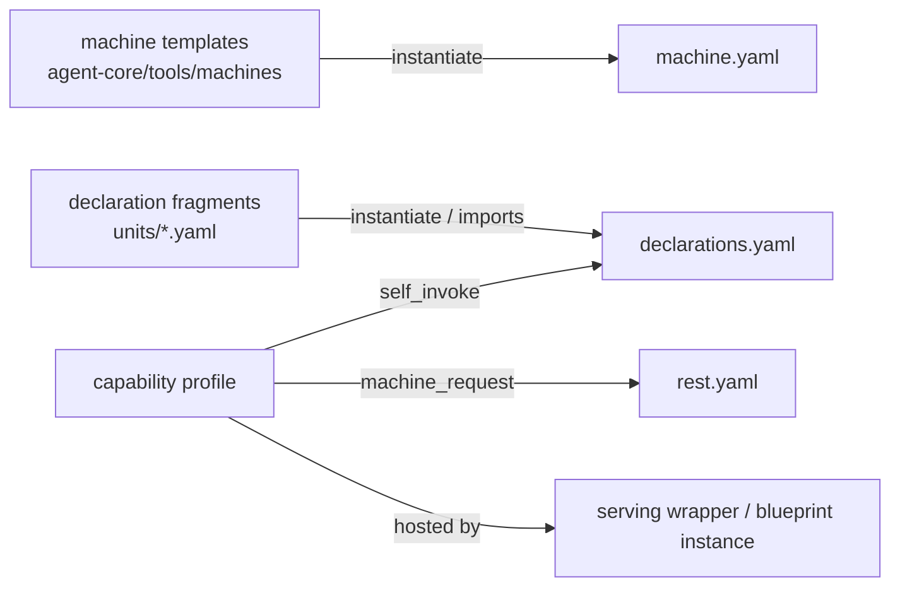

<!-- Copyright (c) 2026 Nokia -->
<!-- SPDX-License-Identifier: BSD-3-Clause -->

# Composition model

One binary runs every agent. `agent-core/cmd/agent/main.go` is the only `main()`; every Kubernetes Deployment in every application uses the same image and differs only in its `--profile` argument. An agent is therefore nothing but a profile: a set of YAML files the binary loads, validates, content-hashes into a program reference, and executes. There is no agent kind field anywhere — an observer and a chatbot use the same grammar and differ only in content.

A profile (`catalog.AgentProfile`, `agent-core/internal/tools/catalog/profile.go`) names its parts:

| File | Holds |
|---|---|
| `profile.yaml` | the name and the paths to everything below |
| `machine.yaml` | the state machine (`core.MachineSpec`): states, signals, transitions, budget |
| `tools.yaml` | a selection list of tool names |
| `declarations.yaml` | tool definitions (`catalog.ToolDef`): contract, parameters, side effects, undo |
| `rest.yaml` | REST servers and routes, bound to machines, monitor views, or static assets |

Only the machine and one tools entry are required. Paths under `/opt/agent-core/` resolve to the installed library (`--core-root` in development), and `libraries:` declares extra named roots.

## How the pieces reuse

Reuse operates at three layers. At the fragment layer, machines instantiate parameterized templates and declaration files import or instantiate shared units (see [fragments.md](fragments.md)). At the path layer, several profiles reference the same files directly; the four coding-agent server profiles share one `role-server/{machine,tools,declarations}.yaml` and differ only in `rest.yaml`. At the profile layer, a whole profile becomes a unit another agent consumes — a capability profile (see [capability-profiles.md](capability-profiles.md)).

There is no profile-includes-profile mechanism, and that is a decision rather than a gap: composition stays at the fragment and path layers, where the closure remains inspectable and content-hashable.

## The consumption forms

The boundary-tool pattern (design-patterns/09-boundary-tool.md) states the invariant: to the parent machine, every boundary looks like one tool emitting one signal. A capability written once as a profile is consumable three ways, specified in srd057.

| Form | Mechanism | Runs as |
|---|---|---|
| Child agent | `self_invoke` / `run_agent` word | child process of the same image |
| Service endpoint | `machine_request` REST binding naming `profile` | per-request machine run to a terminal state |
| Standalone workload | serving wrapper hosting the capability | its own Deployment |

The nested-machine boundary kind is the fourth in the pattern's table, but it is not a fourth form here. Its only word, `run_point`, requires `point_machine`, `point_tools`, and `point_tool_declarations` and carries evaluation-session semantics (srd019), so a capability profile may not assume it. srd057 R2.4 records that, and a general nested-machine word is out of scope.

The workload form is a serving wrapper: a short profile over shared fragments and a serve-template instance. srd055 blueprints stay specified for a group of profiles that differs only in scalars; GH-2123 found none and closed as not planned. See [serving-wrappers.md](serving-wrappers.md).

## Where to read next

[capability-profiles.md](capability-profiles.md) explains writing and consuming a capability. [serving-wrappers.md](serving-wrappers.md) covers hosting one as a workload. [fragments.md](fragments.md) covers templates and declaration units. [ui-panels.md](ui-panels.md) covers the UI layer. The reuse measurements that motivate all of this live in [declaration-statistics.md](declaration-statistics.md).
